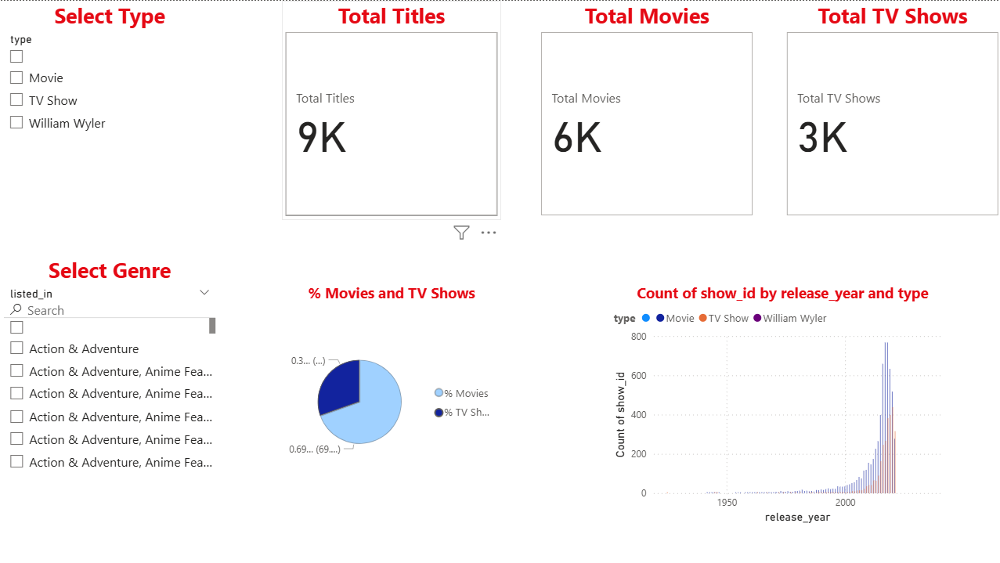

# 📺 Netflix Data Analysis & Dashboard

## 🔹 Overview
This project explores Netflix’s catalogue using data analysis and visualization.  
It includes:
- A **Jupyter Notebook** with Python analysis.
- A **Power BI Dashboard** for interactive insights.

## 🔹 Dataset
Dataset: [Netflix Movies and TV Shows on Kaggle](https://www.kaggle.com/datasets/shivamb/netflix-shows)

## 🔹 Insights
- Movies dominate Netflix’s library compared to TV Shows.
- US and India are top content producers.
- Content additions peaked in 2019–2020.
- Popular genres include International Movies, Dramas, and Comedies.

## 🔹 Files
- `notebook/netflix_analysis.ipynb` → Python data analysis.
- `dashboard/netflix_dashboard.pbix` → Power BI interactive dashboard.
- `data/netflix_titles.csv` → Raw dataset (optional, you may link Kaggle instead).

## 🔹 Dashboard Preview

## 🔹 How to Run
1. Clone the repo.
2. Open the `.ipynb` notebook in Jupyter.
3. Open the `.pbix` file in Power BI Desktop.

## 🔹 Tech Stack
- Python (Pandas, Matplotlib/Seaborn)
- Power BI
